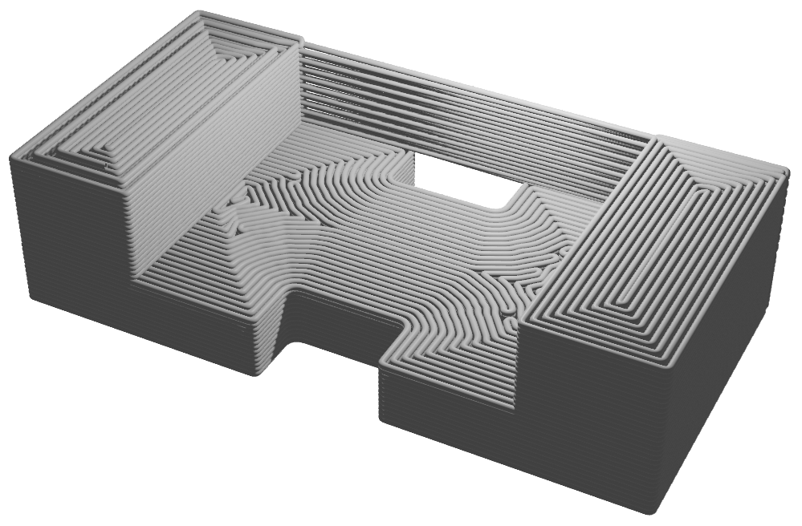
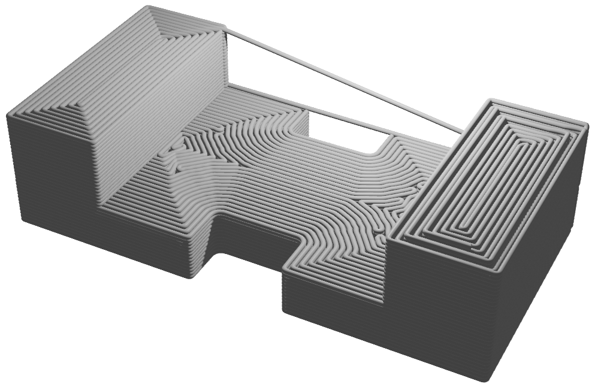
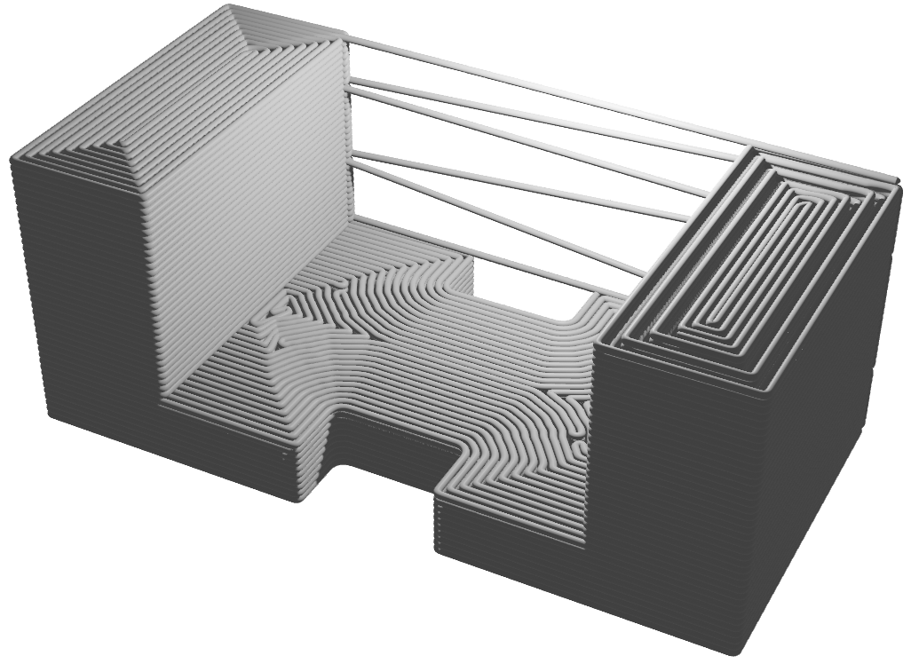

## Continuous Path Planning for FFF

We provide two command-line tools for generation of continuous path and converting the continuous path into g-code.

<p float="left">



</p>

### Usage:

python genCP.py [[--in] <stl file>] [[--out] <path file>] [[--first_layer_thickness] <float number>] [[--layer_thickness] <float number>] [[--infill_offset] <float number>]   

* `--in`:  Input file, only stl format is supported.
* `--out`: Output file.
* `--first_layer_thickness`: The thickness of the first sliced layer.
* `--layer_thickness`: The thickness of each layers
* `--infill_offset`: The distance between each two infilled contours.  
* `--collision_thxy`: The collision threshold in x-y plane, e.g. the default is 50mm.
* `--collision_thz`:   The collision threshold in z direction, e.g. the default is 30mm.

Example:

```
python genCP --in small.stl  --first_layer_thickness 0.2 --layer_thickness 0.3   --infill_offset 0.4  --collision_thxy 30 --collision_thz - 20 
```


### Bibtex
Please cite our [paper](#) (comming soon) if you use this code in your research.
```

```