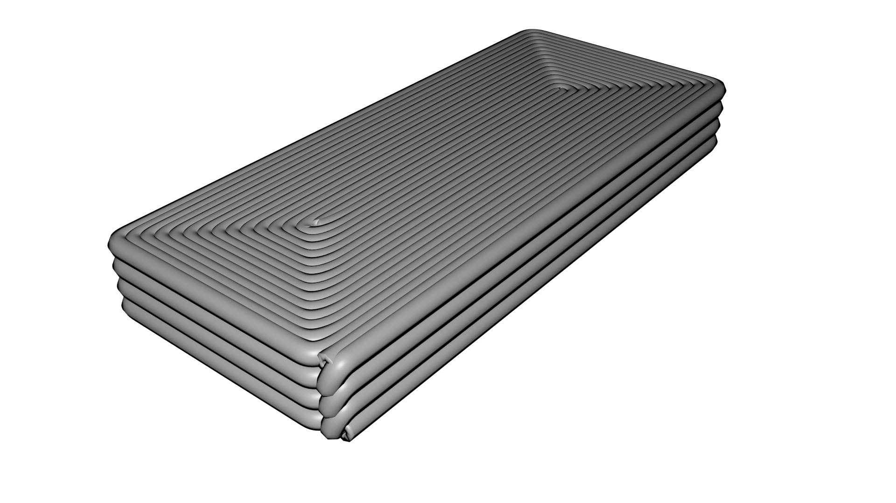
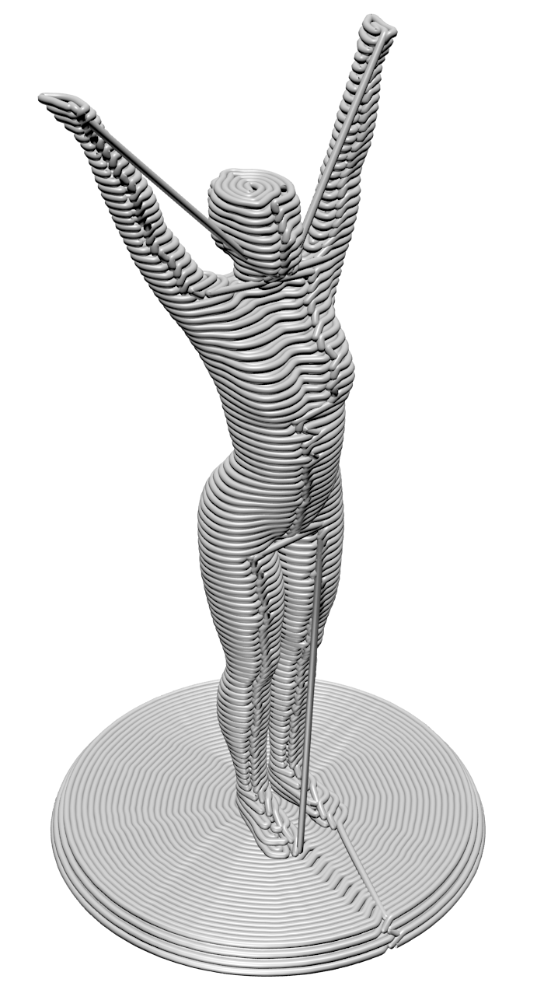

## Continuous Path Planning for FFF

We provide two command-line tools for generation of continuous path and converting the continuous path into g-code.

<p float="left">


</p>

### Usage:

python genCP.py [[--in] <stl file>] [[--out] <path file>] [[--first_layer_thickness] <float number>] [[--layer_thickness] <float number>] [[--infill_offset] <float number>]   

* `--in`:  Input file, only stl format is supported.
* `--out`: Output file.
* `--first_layer_thickness`: The thickness of the first sliced layer.
* `--layer_thickness`: The thickness of each layers
* `--infill_offset`: The distance between each two infilled contours.  
* `--collision_thx`: The collision threshold in x-y plane, e.g. the default is 50mm.

Example:

```
python genCP --in small.stl  --first_layer_thickness 0.2 --layer_thickness 0.3   --infill_offset 0.4
```


### Bibtex
Please cite our [paper](../../../doc/ContiPath.pdf) (unmodified version) if you use this code in your research.
```
@article{SunYao-1311,
   Author = {Sun, Shusen and Yao, Yuan and Jiang, Yunliang},
   Title = {A 3D Continuous Path Generation Method and Evaluation for Fused Deposition Manufacturing in Tissue Engineering},
   Journal = {Journal of Biomaterials and Tissue Engineering},
   Volume = {9},
   Number = {3},
   Pages = {273--282},
   Year = {2019} 
}
```