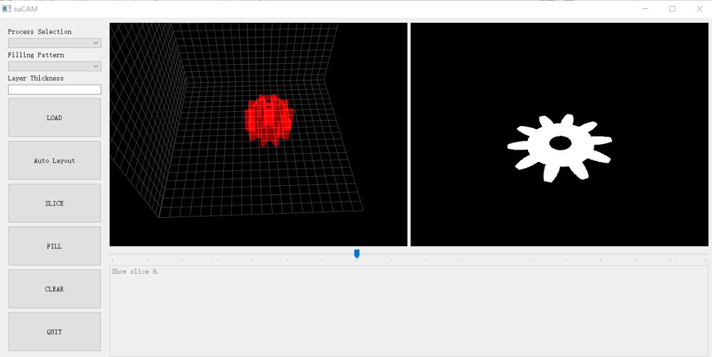

### Introduction
多轴打印路径规划系统目的是提供一个独立的，针对多轴打印的空间填充路径生成工具，目前暂时只能提供平面的填充方式。

### How to use
基本代码已经上传到GitHub的suCAM目录。
- 在使用前注意先安装以下工具和python库
1. install Git bash
2. install Anaconda

- 安装相应工具包
作为探索性的代码，本系统界面的构建依赖于Qt，PyQtgraph，stl的读取依赖于numpy-stl,划分依赖于stl2png；路径生成和优化依赖于opencv、clipper实现。

In git bash window
```
pip install pyqt5
pip install git+https://github.com/pyqtgraph/pyqtgraph
pip install pyOpenGL
pip install numpy-stl
pip install opencv-python
```
3. run "python suCAM.py"

### Method

#### 1. 三角网格模型的处理
三角网格的处理包括流形检测、打印方向判定、区域划分。在单轴打印时，打印方向暂由手工制定。

#### 2. 切片
为简化轮廓处理，切片暂采用[stl2png]https://bitbucket.org/goatchurch/barmesh/src/1e2782de8433?at=master完成。


#### 3. 切片路径填充

填充路径生成使用clipper lib 或参考奥地利萨尔茨堡萨尔茨堡大学的计算机科学专业的[丁赫尔德](https://www.cosy.sbg.ac.at/~held/held.html)提出的通过曲线多边形的Voronoi图计算偏移曲线的[方法](https://ac.els-cdn.com/S0010448597000717/1-s2.0-S0010448597000717-main.pdf?_tid=63fe7c5c-f78a-45a4-9f1f-1986e8f51377&acdnat=1543315797_4f2cb569a0acb261dfd7a5dff27d52c3)。

连续路径生成参考费马螺线的生成方法参考[Zhao et al.](http://irc.cs.sdu.edu.cn/CFS/)的工作。


#### 4.适用于5轴与六轴打印的空间填充与路径生成方法
##### 路径打印顺序
为得到基于二维切片的连续的打印路径，需要连接工件中不同切片的连通区域，并将尽量减少这种连接的数量。

打印序列生成算法根据以下几个原则遍历所有层中的连通区域：

- 打印头与工件是否干涉，通过连通区域间轮廓的最小距离判定
- 可支撑性，通过下层连通区域与上层连通区域重合面积判定

```Algorithm
    r,i,j = d.get_end() 
    while d.size() != 0:  
        if (i < N - 1) and (not is_interference(d, i, j, dist_th) ): 
            S.append([i,j])
            d.remove_item(i,j)            
            i = i + 1     
            r, j = find_surpported_region_in_layer(d, r, i, -6)

            if j == -1:   
                r, i, j = d.get_end() 
                continue
            if i == (N - 1): # reach the top
                if not is_interference(d, i, j, dist_th):
                    S.append([i,j])
                    d.remove_item(i,j)
                r,i,j = d.get_end()                
        else:
            r_next, i_next, j_next = d.get_end() 
            if [i,j] == [i_next, j_next]:  #the nozzle goes back and the region is not be appended
                S.append([i,j]) 
                d.remove_item(i,j)
                r_next, i_next, j_next = d.get_end()
            else:
                if i <= i_next: # The new region is not lower than current, 
                    S.append([i,j]) # so the nozzle doesn't need to go down. 
                    d.remove_item(i,j)
            r = r_next
            i = i_next
            j = j_next
    
```


